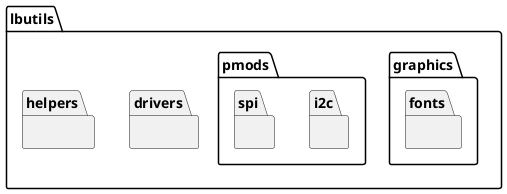
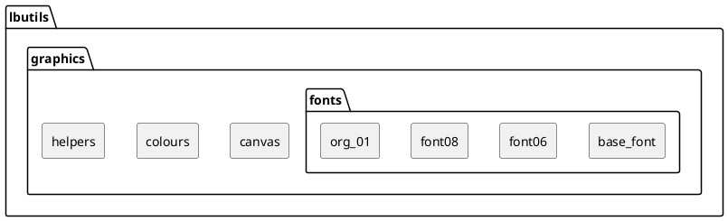

# LBUtils

## Background

This library is designed to install all of the common drivers, library code, and helper code used within modules at Leeds Beckett University. It is principally targeted at MicroPython on the Pico H/W micro-controllers: but compatibility is also maintained with CPython 3.10 where possible (or relevant).

Examples for how to use the library can be found in the '`examples`' folder: or [in the documentation](https://dlove24.github.io/lbutils/lbutils/examples/index.html). Otherwise the library is organised as follows

* **[`drivers`][lbutils.drivers]**: Classes aimed at low-level support of I2C, SPI
and other devices requiring board-level support.
* **[`graphics`][lbutils.graphics]**: Classes providing basic drawing and font support for display drivers.
* **[`helpers`][lbutils.helpers]**: Functions and classes which help replace boiler-plate code for tasks such as setting up network access.
* **[`pmods`][lbutils.pmods]**: Drivers and support for the
[Digilent peripheral modules](https://digilent.com/reference/pmod/start).

## Library Module and Package Layout

Many of the classes and functions provided by this library are split across multiple files, which are organised into [_modules_](https://docs.python.org/3/tutorial/modules.html) and [_packages_](https://docs.python.org/3/tutorial/modules.html#packages). In most cases the distinction between a module and a package in Python isn't that relevant: unless you are searching for the location of a specific class or method.

In most cases the packages will automatically export the classes of the contained modules: so the [`Colour`][lbutils.graphics.Colour] class, for instance, is available as both `lbutils.graphics.colours.Colour` and `lbutils.graphics.Colour`. The recommend `import` statement for this library is therefore

````python
from lbutils import graphics
from lbutils.graphics import colours, fonts
````

The module name is will be part of the `class` documentation, but in most cases the short form (using only the package name) is preferred.

To make the distinction between modules and packages easier to follow when navigating the documentation, the package documentation will distinguish between them as follows. Diagrams noting the core packages will denote those packages with a 'tag' containing the module name, as in the following package structure for the library



Modules within the packages will, by contrast, simply be drawn as a rounded rectangle; as in the following structure for the [`graphics`][lbutils.graphics] library



At a high-level, the overall structure of the classes into packages and modules in the library is therefore organised as follows


## Installation

A package of this library is provided on PyPi as [`lbutils-mp`](https://pypi.org/project/lbutils-mp/). This can be installed with the normal Python tools, and should also install to boards running MicroPython under [Thonny](https://thonny.org/).

For manual installation, everything under the `lbutils` directory should be copied to the appropriate directory on the MicroPython board, usually `/lib`. The library, or individual drivers, can then be imported as normal: see the documentation for the [examples](https://lbutils.readthedocs.io/en/latest/examples) for more detailed guidance on the use of the library. This code is also available in the `examples` folder on [GitHub](https://github.com/dlove24/lbutils).

## Notes

- This library is principally a teaching library, so the [Documentation](https://lbutils.readthedocs.io) is be at least as important as the 'code'. Where possible all algorithms and implementation techniques are explained as fully as possible, or at least linked to reference standards/implementations

- All documentation is be organised according to the [Diátaxis](https://diataxis.fr/) framework: ideally with examples that do not require specific board set-ups. Where possible other sites such as [WokWi](https://wokwi.com) are used to give expanded examples that do not require installation.

- For consistency, all code is in the format standardised by the [Black](https://github.com/psf/black) library. The library is also fully typed, with accommodations made for the lack of a full type implementation on MicroPython.

- Documentation is generated by [MkDocs](https://www.mkdocs.org), using the embedded comments in the code. All documentation strings are in the [Markdown format accepted by MkDocs](https://www.mkdocs.org/user-guide/configuration/#markdown_extensions), and are automatically rebuilt on commit. This also extends to class and other diagrams where possible.

## Known Implementations

- Raspberry Pi Pico W (MicroPython 3.4)
- CPython (3.10)
