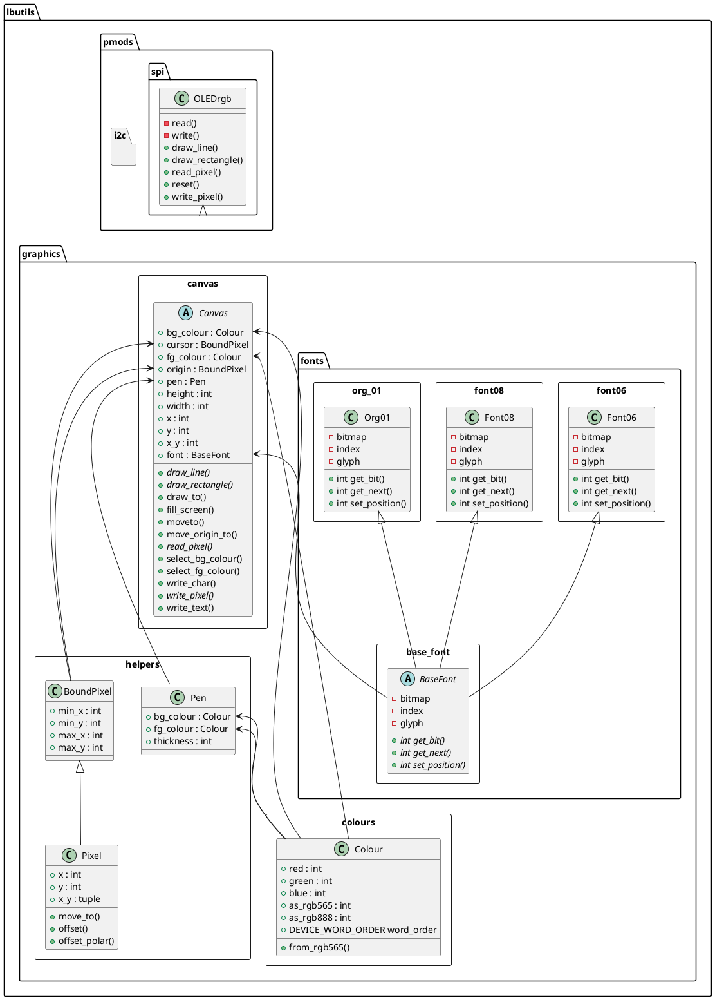
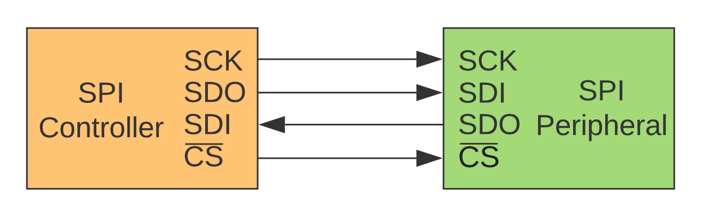

# Pmod Drivers

## Package Structure

The `lbutils.pmods` package provides drivers and support for the Digilent Peripheral Modules. This library is designed to provide drivers and support for the [Digilent peripheral modules](https://digilent.com/reference/pmod/start). Not all boards are supported: and in some cases only certain busses are supported (e.g. using only the I2C bus, even though the `pmod` supports both I2C and SPI).

These packages are organised into the following structure, with [`i2c`][lbutils.pmods.i2c] and [`spi`][SPI Drivers] documented separately in more detail.

## SPI Conventions

!!! note "Modern SPI Name in Use"
     For this module, and all SPI references in the library, the [modern SPI
     names](https://www.oshwa.org/a-resolution-to-redefine-spi-signal-names/) are in
     use. However, most  of the PMod reference documentation (and the underlying
     hardware devices) still use the older terms.

**Figure 1: Modern Naming Conventions for the SPI Interfaces [CC0 – Public Domain]**

In general each module will require a minimum of four pins for the SPI
interface, as shown in Figure 1. For the SPI modes in the [PMod Interface
Specification Version
1.2.0](https://digilent.com/reference/_media/reference/pmod/pmod-interface-
specification-1_2_0.pdf) at least two pins are additionally required for +3.3V
(Pins 6 and 12) and 0V (Pin 5 and 11). This means that for most PMods using the
12-pin SPI jumper interface, the following basic pattern will hold (numbers
refer to the default GPIO pin assignment for the Pico H/W on the Leeds Beckett
micro-controller development board)

|        | Pin Name      | Number       | Description                         |
|--------|---------------|--------------|-------------------------------------|
| Pin 1  | CS            | 14           | SPI Chip Select                     |
| Pin 2  | SDO           | 19           | SPI Serial Data Out                 |
| Pin 3  | SDI           | 16           | SPI Serial Data In                  |
| Pin 4  | SCK           | 17           | SPI Serial Clock                    |
| Pin 5  | GND           | 3            | Ground                              |
| Pin 6  | VCC           | 5            | VCC (+3.3V)                         |
| Pin 7  |               |              |                                     |
| Pin 8  |               |              |                                     |
| Pin 9  |               |              |                                     |
| Pin 10 |               |              |                                     |
| Pin 11 | GND           | 3            | Ground                              |
| Pin 12 | VCC           | 5            | VCC (+3.3V)                         |

Examples for specific pin interfaces for individual modules can be found in the '`examples`' folder: or [in the documentation](https://lbutils.readthedocs.io/en/latest/) for each class below.

## Tested Implementations

This version is written for MicroPython 3.4, and has been tested on:

  * Raspberry Pi Pico H/W

